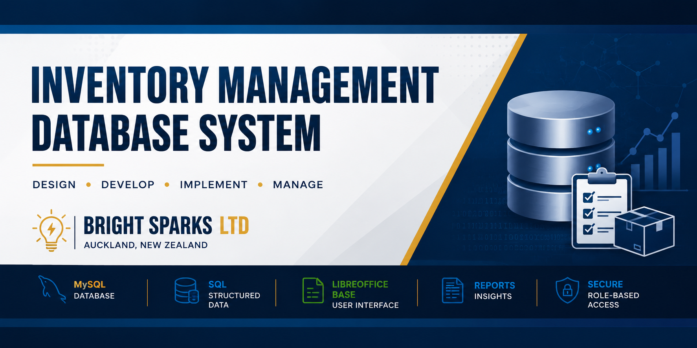
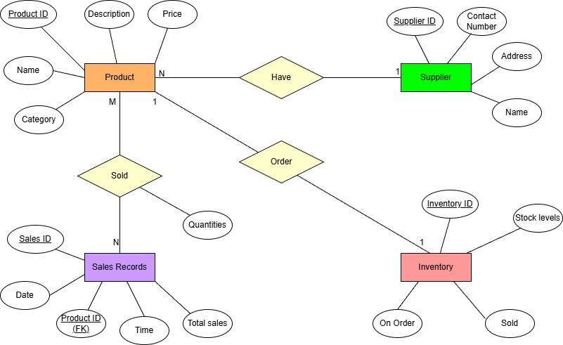

# Inventory Management Database System



A relational database project built for **Bright Sparks Ltd**, a fictional Auckland electronics retailer, to manage products, suppliers, inventory and sales.

---

## What This Project Does

The system replaces manual inventory tracking with a structured MySQL database. It stores product, supplier, inventory and sales information, then uses forms, queries and reports to make that data easier to manage.

The project includes:

- MySQL database design
- Entity Relationship Diagram
- Normalisation from UNF to 3NF
- SQL database export
- LibreOffice Base interface
- Forms, queries and reports
- Role-based permissions
- Testing evidence

---

## Database Design

### Entity Relationship Diagram



The database was designed around products, suppliers, inventory and sales. Primary and foreign keys connect the tables and reduce repeated data.

### Normalisation

The design was normalised from the original unnormalised scenario through to Third Normal Form.

| Stage | File |
|---|---|
| UNF | `diagrams/UNF.png` |
| 1NF | `diagrams/1NF.png` |
| 2NF | `diagrams/2NF.png` |
| 3NF | `diagrams/3NF.png` |

---

## Technologies Used

| Technology | Purpose |
|---|---|
| MySQL 8 | Database |
| SQL | Table creation, queries and data management |
| LibreOffice Base | Interface, forms and reports |
| Git | Version control |
| GitHub | Portfolio hosting |

---

## Repository Structure

```text
inventory-management-database
│
├── assets/        Project banner and visual assets
├── database/      SQL export and schema documentation
├── diagrams/      ERD and normalisation diagrams
├── docs/          Project documentation
├── screenshots/   Forms, queries, reports and testing evidence
├── CHANGELOG.md
├── LICENSE
├── README.md
└── .gitignore
```

---

## Database

The full MySQL export is included here:

```text
database/BrightSparks_Database.sql
```

See the `database/` folder for schema, table and relationship notes.

---

## Documentation

The `docs/` folder contains short project documents covering:

- Executive Summary
- Company Overview
- Business Case
- Project Objectives
- Requirements Analysis
- Project Planning
- Database Design
- Database Implementation
- Testing and Evaluation
- Reflection
- Future Development

---

## Screenshots

Screenshots are stored in the `screenshots/` folder and show the working system, including forms, queries, reports and database evidence.

---

## Future Improvements

If I rebuilt this system today, I would add:

- Web-based interface
- Secure login
- Barcode scanning
- Stock alert notifications
- Management dashboard
- Cloud backup
- Mobile/tablet support

---

## Author

**Deacon George**  
New Zealand  
GitHub: [deacongeorgenz](https://github.com/deacongeorgenz)
